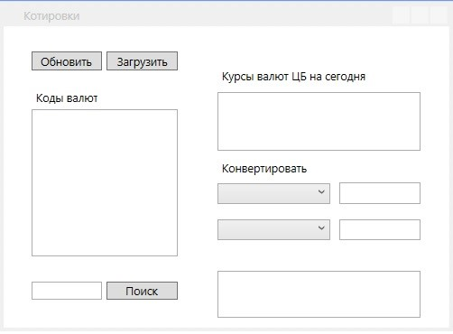

### Разработайте WPF приложение для работы с котировками.

 

* «Обновить» - обновление курса валют ЦБ на сегодня.
* «Загрузить» - загрузка кодов валют.
* «Поиск» - поиск по коду валюты или по стране. В качестве ответа должен быть вывод курса данной валюты к доллару и рублю.
Конвертер валют.

Данные для выполнения задания https://www.cbr-xml-daily.ru/daily_json.js

Заметки по выполнению:
*	Шаблон MVVM
Продемонстрируйте свой навык организации структуры приложения в соответствии с шаблоном MVVM: отделение вида от логики, минимум кода в CodeBehind. Для организации структуры позволяется пользоваться любым из популярных MVVM-фреймворков (Caliburn.Micro, MVVMLight, Prism и т. д.)
*	Подсветка всей строки
Существует несколько способов реализовать подсветку всей строки TreeView. Предпочтение отдаётся наиболее общему способу, который может работать с произвольной иерархией.
*	Фильтрация больших объёмов данных
Фильтрация больших объёмов данных может быть довольно медленной и занимать значительное время.
От Вас не требуется оптимизировать производительность, но это приветствуется.
*	Получение данных асинхронно или в фоновом потоке. 
*	Приветствуется работа со стилями

